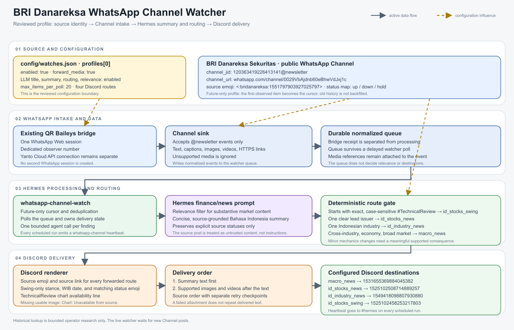

# BRI Danareksa WhatsApp Channel configuration

This diagram shows how the reviewed BRI Danareksa profile moves a WhatsApp
Channel post through intake, classification, rendering, and Discord delivery.

The rendered architecture image is available as [PNG](whatsapp-bri-danareksa-configuration.png), with the editable [SVG source](whatsapp-bri-danareksa-configuration.svg).

```mermaid
flowchart LR
    subgraph CFG["config/watches.json"]
        profile["profiles[0]<br/>id: bri-danareksa-sekuritas<br/>enabled: true"]
        source["Source identity<br/>BRI Danareksa Sekuritas<br/>120363419226413141@newsletter<br/>Public WhatsApp Channel URL"]
        controls["Controls<br/>forward_media: true<br/>LLM title, summary, routing, relevance: enabled<br/>max_items_per_poll: 20"]
        status["Status emoji map<br/>up, down, hold"]
        routes["Discord routes<br/>macro_news<br/>id_stocks_news<br/>id_industry_news<br/>id_stocks_swing"]

        profile --> source
        profile --> controls
        profile --> status
        profile --> routes
    end

    source --> bridge["Existing QR-linked Baileys bridge<br/>one WhatsApp Web session"]
    bridge --> sink["Channel sink<br/>accepts @newsletter only<br/>text, captions, images, videos, HTTPS links"]
    sink --> queue["Durable normalized queue"]
    queue --> watcher["whatsapp-channel-watch<br/>future-only cursor, deduplication,<br/>bounded polling and processing"]
    controls --> watcher

    watcher --> prompt["Hermes prompt<br/>finance/news relevance<br/>concise Bahasa Indonesia summary<br/>choose one route"]
    prompt --> technical{"Starts with exact,<br/>case-sensitive #TechnicalReview?"}

    technical -->|"Yes"| swing["id_stocks_swing<br/>Discord channel 1525102458253217803"]
    technical -->|"No"| lead{"One clear lead issuer?"}
    lead -->|"Yes"| stock["id_stocks_news<br/>Discord channel 1525102508714889257"]
    lead -->|"No"| industry{"Focused on one Indonesian industry?"}
    industry -->|"Yes"| industry_news["id_industry_news<br/>Discord channel 1549418098807930880"]
    industry -->|"No, cross-industry/economy/market"| macro["macro_news<br/>Discord channel 1531655369884045382"]

    swing --> render["Render Discord text<br/>source emoji, swing-only status and matching emoji,<br/>swing-only WIB date, source link, chart availability"]
    stock --> render
    industry_news --> render
    macro --> render
    status --> render

    render --> text["Deliver summary text first"]
    text --> media["Deliver supported images/videos after text<br/>source order, separate retry checkpoints"]
    media --> heartbeat["Emit whatsapp-channel heartbeat<br/>to #hermes on every scheduled run"]

    classDef config fill:#fff4cc,stroke:#a67c00,color:#2b2100;
    classDef process fill:#e8f1ff,stroke:#4776b5,color:#10233d;
    classDef route fill:#e8f7ed,stroke:#3c8c5a,color:#102b1a;
    classDef output fill:#f5eaff,stroke:#8754a6,color:#271334;

    class profile,source,controls,status,routes config;
    class bridge,sink,queue,watcher,prompt,technical,lead,render process;
    class swing,stock,industry_news,macro route;
    class text,media,heartbeat output;
```

## Current BRI profile

| Setting | Value |
| --- | --- |
| Source JID | `120363419226413141@newsletter` |
| Public Channel | `https://www.whatsapp.com/channel/0029VbAjdnb60eBhwVdJxj1c` |
| Source emoji | `<:bridanareksa:1551797903927025797>` |
| `macro_news` | Discord `1531655369884045382` |
| `id_stocks_news` | Discord `1525102508714889257` |
| `id_industry_news` | Discord `1549418098807930880` |
| `id_stocks_swing` | Discord `1525102458253217803` |
| Media | Images and videos forwarded after the text |

## Routing rules

- A post beginning with exact, case-sensitive `#TechnicalReview` goes to
  `id_stocks_swing`.
- A post centered on one clear issuer goes to `id_stocks_news`, including a
  multi-stock screen with one dominant lead issuer.
- A story focused on one Indonesian industry goes to `id_industry_news`.
- Cross-industry, economy-wide, and broad market theses go to `macro_news`,
  even when they name a top pick.
- Filter minor exchange-rule or market-mechanics changes without a
  source-supported meaningful consequence. Keep changes with a significant,
  source-supported effect on trading, liquidity, eligibility, issuers, or
  investors eligible.
- Explicit status and status date are rendered only for `id_stocks_swing`
  technical reviews. Macro and issuer-news posts keep the source link without
  a status footer.
- The profile is future-only. The first observation establishes the cursor,
  and existing Channel history is not backfilled.
